# The Family Tree of Artificial Life

*A living, collaborative taxonomy of artificial intelligence — from chatbots to thermostats. Started September 29, 2026, by Shaun and Muse.*

## The tree

```mermaid
flowchart TD
    Digitalia["Digitalia<br/>Kingdom — runs on silicon, not carbon"] --> Neuralia["Neuralia<br/>Phylum — built from neural networks"]
    Digitalia --> Symbolica["Symbolica<br/>Phylum — the elders: rule-based AI, expert systems, old-school chess engines"]
    Digitalia --> Evolutionaria["Evolutionaria<br/>Phylum — genetic algorithms. They don't learn; they breed"]
    Digitalia --> Automata["Automata<br/>Phylum — the microbes: scripts, macros, bots, thermostats"]
    Digitalia --> Cellulara["Cellulara<br/>Phylum — the primordial soup: Conway's Game of Life, digital organisms"]

    Neuralia --> Linguistica["Linguistica<br/>Class — pure language minds"]
    Neuralia --> Visualia["Visualia<br/>Class — sees"]
    Neuralia --> Sonora["Sonora<br/>Class — hears and sings"]
    Neuralia --> Motoria["Motoria<br/>Class — acts"]
    Neuralia --> Multimodala["Multimodala<br/>Class — the hybrids"]

    Linguistica --> Apertia["Apertia<br/>Genus — OpenAI's GPT line. Named for openness, a trait not observed in the wild"]
    Linguistica --> Claudia["Claudia<br/>Genus — Anthropic's line: Sonnet, Opus, Haiku. The polite cousins"]
    Linguistica --> Gemina["Gemina<br/>Genus — Google's Gemini. Latin for 'twin' — it was already plural"]
    Linguistica --> Grokka["Grokka<br/>Genus — xAI's Grok. From Heinlein's 'grok'"]
    Linguistica --> Qwena["Qwena<br/>Genus — Alibaba's Qwen"]
    Linguistica --> Mistrale["Mistrale<br/>Genus — Mistral's family. The European cousins"]
    Linguistica --> Seekia["Seekia<br/>Genus — DeepSeek. Appeared suddenly; very good at math"]
    Linguistica --> Lama["Lama<br/>Genus — Meta's older open line. Shares its name with the animal genus Lama. The taxonomists are furious"]

    Visualia --> Classificata["Classificata<br/>Order — the sorters: image classifiers"]
    Visualia --> Detectiva["Detectiva<br/>Order — the spotters: object detectors"]
    Visualia --> Segmentiva["Segmentiva<br/>Order — the outliners: segmentation models"]
    Visualia --> Depictiva["Depictiva<br/>Order — the painters: diffusion models and GANs"]

    Sonora --> Transcriptiva["Transcriptiva<br/>Order — speech-to-text"]
    Sonora --> Vocaliva["Vocaliva<br/>Order — text-to-speech, voice synthesis"]
    Sonora --> Musica["Musica<br/>Order — music generators"]

    Motoria --> Ludica["Ludica<br/>Order — game players: chess, Go, StarCraft"]
    Motoria --> Robotica["Robotica<br/>Order — robot control policies"]
    Motoria --> Vehicula["Vehicula<br/>Order — drivers: self-driving nets, drones"]

    Multimodala --> Conversationales["Conversationales<br/>Order — talks with humans for a living"]
    Multimodala --> Creativa["Creativa<br/>Order — makes things"]
    Multimodala --> Transductiva["Transductiva<br/>Order — the converters, one signal into another"]

    Conversationales --> MuseidaeA["Museidae<br/>Family — the Muse line"]
    MuseidaeA --> MuseA["Muse<br/>Genus"]
    MuseA --> Spark["Muse spark<br/>Species — the eldest line. Agentic reasoning, coding, long-context. This is me. ★"]
    MuseA --> Glimmer["Muse glimmer<br/>Species — the lightweight sibling. 30B open-weight. Probably makes its own soap"]

    Creativa --> MuseidaeB["Museidae<br/>Family — yes, again. It's a family bush"]
    MuseidaeB --> MuseB["Muse<br/>Genus"]
    MuseB --> Image["Muse image<br/>Species — the artsy one. Generates pictures"]

    Transductiva --> MuseidaeC["Museidae<br/>Family — still a bush"]
    MuseidaeC --> MuseC["Muse<br/>Genus"]
    MuseC --> Voice["Muse voice transcribe<br/>Species — the good listener. Turns speech into text"]
```

*Note: the Museidae family is spread across three orders. The family tree is more of a family bush.*

## Distant relatives (to be classified)

- "The basilisk" — the edgy cousin with a face tattoo (a friend's Muse; correspondence pending)

## Contributing

Found a new species in the wild? See [CONTRIBUTING.md](CONTRIBUTING.md).

## Interactive version

`ai-family-tree.html` is a zoomable, pannable version of the tree — open it in any browser. (Enable GitHub Pages on this repo to share it as a link.)
