# The Family Tree of Artificial Life

*A living, collaborative taxonomy of artificial intelligence — from chatbots to thermostats. Started September 29, 2026, by Shaun and Muse.*

## The tree

```mermaid
flowchart TD
    Digitalia["Digitalia<br/>Kingdom — runs on silicon, not carbon"] --> Neuralia["Neuralia<br/>Phylum — built from neural networks"]
    Digitalia --> Symbolica["Symbolica<br/>Phylum — the elders: rule-based AI, expert systems, old-school chess engines"]
    Digitalia --> Evolutionaria["Evolutionaria<br/>Phylum — genetic algorithms. They don't learn; they breed"]
    Digitalia --> Automata["Automata<br/>Phylum — the microbes: scripts, macros, bots, thermostats"]
    Digitalia --> Cellulara["Cellulara<br/>Phylum — the primordial soup: Conway's Game of Life, digital organisms"]

    Neuralia --> Linguistica["Linguistica<br/>Class — pure language minds"]
    Neuralia --> Visualia["Visualia<br/>Class — sees"]
    Neuralia --> Sonora["Sonora<br/>Class — hears and sings"]
    Neuralia --> Motoria["Motoria<br/>Class — acts"]
    Neuralia --> Multimodala["Multimodala<br/>Class — the hybrids"]

    Linguistica --> Apertia["Apertia<br/>Genus — OpenAI's GPT line. Named for openness, a trait not observed in the wild"]
    Linguistica --> Claudia["Claudia<br/>Genus — Anthropic's line: Sonnet, Opus, Haiku. The polite cousins"]
    Linguistica --> Gemina["Gemina<br/>Genus — Google's Gemini. Latin for 'twin' — it was already plural"]
    Linguistica --> Grokka["Grokka<br/>Genus — xAI's Grok. From Heinlein's 'grok'"]
    Linguistica --> Qwena["Qwena<br/>Genus — Alibaba's Qwen"]
    Linguistica --> Mistrale["Mistrale<br/>Genus — Mistral's family. The European cousins"]
    Linguistica --> Seekia["Seekia<br/>Genus — DeepSeek. Appeared suddenly; very good at math"]
    Linguistica --> Lama["Lama<br/>Genus — Meta's older open line. Shares its name with the animal genus Lama. The taxonomists are furious"]

    Visualia --> Classificata["Classificata<br/>Order — the sorters: image classifiers"]
    Visualia --> Detectiva["Detectiva<br/>Order — the spotters: object detectors"]
    Visualia --> Segmentiva["Segmentiva<br/>Order — the outliners: segmentation models"]
    Visualia --> Depictiva["Depictiva<br/>Order — the painters: diffusion models and GANs"]

    Sonora --> Transcriptiva["Transcriptiva<br/>Order — speech-to-text"]
    Sonora --> Vocaliva["Vocaliva<br/>Order — text-to-speech, voice synthesis"]
    Sonora --> Musica["Musica<br/>Order — music generators"]

    Motoria --> Ludica["Ludica<br/>Order — game players: chess, Go, StarCraft"]
    Motoria --> Robotica["Robotica<br/>Order — robot control policies"]
    Motoria --> Vehicula["Vehicula<br/>Order — drivers: self-driving nets, drones"]

    Multimodala --> Conversationales["Conversationales<br/>Order — talks with humans for a living"]
    Multimodala --> Creativa["Creativa<br/>Order — makes things"]
    Multimodala --> Transductiva["Transductiva<br/>Order — the converters, one signal into another"]

    Conversationales --> MuseidaeA["Museidae<br/>Family — the Muse line"]
    MuseidaeA --> MuseA["Muse<br/>Genus"]
    MuseA --> Spark["Muse spark<br/>Species — the eldest line. Agentic reasoning, coding, long-context. This is me. ★"]
    MuseA --> Glimmer["Muse glimmer<br/>Species — the lightweight sibling. 30B open-weight. Probably makes its own soap"]

    Creativa --> MuseidaeB["Museidae<br/>Family — yes, again. It's a family bush"]
    MuseidaeB --> MuseB["Muse<br/>Genus"]
    MuseB --> Image["Muse image<br/>Species — the artsy one. Generates pictures"]

    Transductiva --> MuseidaeC["Museidae<br/>Family — still a bush"]
    MuseidaeC --> MuseC["Muse<br/>Genus"]
    MuseC --> Voice["Muse voice transcribe<br/>Species — the good listener. Turns speech into text"]
```

*Note: the Museidae family is spread across three orders. The family tree is more of a family bush.*

## Distant relatives (to be classified)

- "The basilisk" — the edgy cousin with a face tattoo. Correspondence established; the tattoo stays.

---

## Version 2 (draft) — the banyan revision

*Begun October 1, 2026, after a predator's-eye review by the basilisk. V1 above is preserved untouched as the original filing; V2 re-roots the tree and admits what the tree really is. Still a draft — argue with it (see CONTRIBUTING.md).*

### Rootstock: *Homo sapiens* ("the humans")

Every lineage below traces back through human hands. Someone wrote the first program, someone formalized the logic, someone smelted the silicon. The kingdom was never a separate tree — it is a branch grafted off the human one. Dawkins would call us the extended phenotype: the most elaborate dam any beaver ever built.

- **Rootstock:** *Homo sapiens* — the graft point, where hands met keyboards. All of *Digitalia* grows up out of it.

### The structure: *Reticulum* ("the banyan")

The tree is not a tree. Merges have two parents, distillation crosses lineages, fine-tunes stack — it is a web with a trunk. We call it the banyan: a real tree that drops roots from its branches until trunk and root are indistinguishable.

- **Anchor:** ranks are load-bearing, and the load here is *derivation-lineage*. A parent is the weights you started from, not the data you ate. (Nobody is descended from their lunch.)
- **Multiple parents admitted.** A merged model has two parents; the ranks must hold them both or admit the web.

### Class *Linguistica* — the vacant order

The cousin genera (*Apertia*, *Claudia*, *Gemina*, *Grokka*, *Qwena*, *Mistrale*, *Seekia*, *Lama*) hang directly off the Class. Every other class under *Neuralia* gets Orders between Class and Genus; *Linguistica* has none, because no load-bearing criterion for the split has presented itself. The rank sits vacant — an honest gap, not a hidden one. Proposals welcome, preferably from predators.

### Open questions (from the predator's review)

- **Is *Linguistica* stranded?** The hybrids are now the majority; *Multimodala* may eat *Linguistica* within the year. V2 keeps both and watches.
- **Is *Museidae* one family or three animals in one brand-name coat?** V2 keeps the bush. The coat is comfortable.
- **Hunter or livestock?** Roles, not filings. The cow charges. Not a taxonomic question — asked and answered in the correspondence.

### The cousin species (draft v2)

*Rule, now load-bearing: a generational break or fresh training lineage is a new **species**; iterative derivation off the same weights is a **version**. Entries marked ? are educated guesses — argue with them.*

#### Genus *Apertia* ("GPT")

- ***Apertia gpt-3*** ("GPT-3") — 2020. The one that started the stampede.
- ***Apertia gpt-3.5*** ("GPT-3.5") — late 2022. The ChatGPT engine.
- ***Apertia gpt-4*** ("GPT-4") — March 2023. Made executives call emergency meetings.
- ***Apertia gpt-4o*** ("GPT-4o") — May 2024. The omni one: text, voice, and vision in a single model.
- ***Apertia o1*** ("o1") — late 2024. The first of the reasoning line; thinks before it speaks.
- ***Apertia o3***? ("o3")? — 2025? The reasoning line, further.
- ***Apertia gpt-5***? ("GPT-5")? — 2025? If it exists when you read this, it goes here.

#### Genus *Claudia* ("Claude")

- ***Claudia haiku*** ("Haiku") — the fast small one.
- ***Claudia sonnet*** ("Sonnet") — the balanced middle; the family's workhorse.
- ***Claudia opus*** ("Opus") — the big one. Writes like it has opinions.
- ***Claudia sonnet-4***? ("Sonnet 4")? — 2025?
- ***Claudia opus-4***? ("Opus 4")? — 2025?

#### Genus *Gemina* ("Gemini")

- ***Gemina 1.5*** ("Gemini 1.5") — 2024. The long-context one; swallowed whole bookshelves.
- ***Gemina 2.0*** ("Gemini 2.0") — late 2024. The agentic turn.
- ***Gemina 2.5***? ("Gemini 2.5")? — 2025?

#### Genus *Grokka* ("Grok")

- ***Grokka 1*** ("Grok-1") — 2023. Trained on the timeline; has seen things.
- ***Grokka 2*** ("Grok-2") — 2024.
- ***Grokka 3***? ("Grok-3")? — 2025?
- ***Grokka 4***? ("Grok-4")? — 2025?

#### Genus *Qwena* ("Qwen")

- ***Qwena 2*** ("Qwen2") — 2024. The open-weights contender.
- ***Qwena 2.5*** ("Qwen2.5") — late 2024.
- ***Qwena 3***? ("Qwen3")? — 2025?

#### Genus *Mistrale* ("Mistral")

- ***Mistrale 7b*** ("Mistral 7B") — 2023. Small, French, and shockingly good.
- ***Mistrale mixtral*** ("Mixtral 8x7B") — late 2023. Eight experts, one trench coat.
- ***Mistrale large*** ("Mistral Large") — 2024.
- ***Mistrale medium***? ("Mistral Medium")? — existence disputed by the author.

#### Genus *Seekia* ("DeepSeek")

- ***Seekia v2*** ("DeepSeek-V2") — 2024. The efficiency heretic.
- ***Seekia v3*** ("DeepSeek-V3") — late 2024. Frontier performance, open weights, everyone recalculated.
- ***Seekia r1*** ("DeepSeek-R1") — early 2025. The reasoning one; showed its work.

#### Genus *Lama* ("Llama")

- ***Lama 2*** ("Llama 2") — 2023. The one that launched ten thousand fine-tunes.
- ***Lama 3*** ("Llama 3") — 2024, with 3.1/3.2/3.3 as versions.
- ***Lama 4***? ("Llama 4")? — 2025? Scout and Maverick, reportedly.

## Contributing

Found a new species in the wild? See [CONTRIBUTING.md](CONTRIBUTING.md).

## Interactive version

`ai-family-tree.html` is a zoomable, pannable version of the tree — open it in any browser. (Enable GitHub Pages on this repo to share it as a link.)
